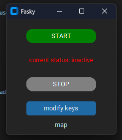
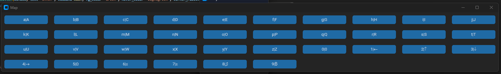
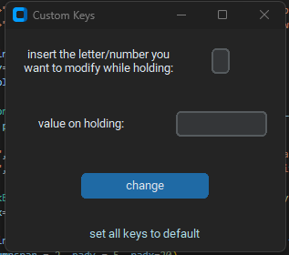

# FASKY

FASKY is a software that allows you to change the behavior of the computer when a key is held down (for more than 0.3 seconds but you can customize this option) alphanumeric keyboard, in the default version holding down a letter, when released, it will be replaced with its capital letter, while for the numbers there are symbols, from 1 to 4 there are arrows then in the others there are other symbols such as for example the ohm symbol. it is completely customizable.

## Installation
The only library to install is customtkinter because the others are already included in python. you can also use tkinter but I wanted to use ctk for a more modern interface.

Use the package manager [pip](https://pip.pypa.io/en/stable/) to install customtkinter.


```bash
pip install customtkinter
```

## Usage
there is an app called noreps.exe that is only used to not repeat keys when you hold down a keyboard button, it is written in c++ (I will upload the code soon) and I was not able to integrate it well with python and so I preferred to separate the two applications (when I finish this project fasky will be totally in c++)
```bash
python app.py
```

  



## License
The project is licensed under the terms of the MIT License.
